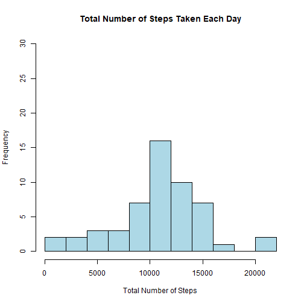
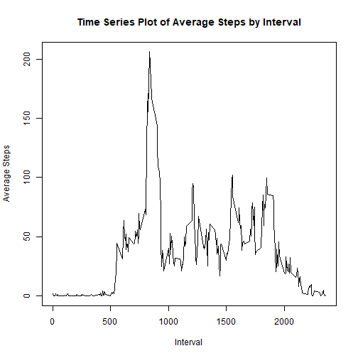
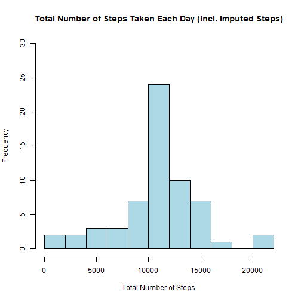
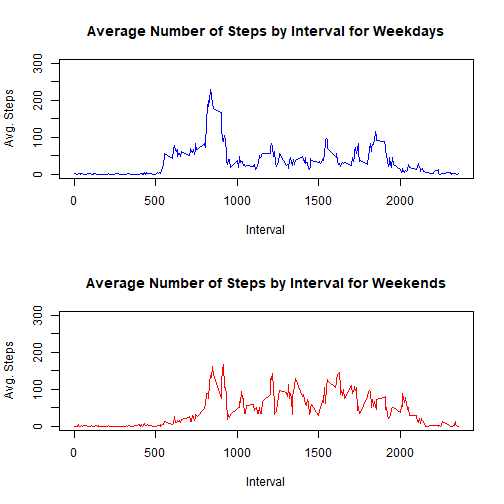

## Loading and preprocessing the data
Code for reading in the dataset and/or processing the data.

Load and process the activity.csv file. Transform the data if necessary.


```r
setwd("C:/Users/jenny/Documents/R Class/RepData_PeerAssessment1")
active_data<-read.csv("activity.csv")

## What does the first six rows look like?
head(active_data)
```

```
##   steps       date interval
## 1    NA 2012-10-01        0
## 2    NA 2012-10-01        5
## 3    NA 2012-10-01       10
## 4    NA 2012-10-01       15
## 5    NA 2012-10-01       20
## 6    NA 2012-10-01       25
```

```r
#How many missing values are there for "steps?"
sum(is.na(active_data$steps))
```

```
## [1] 2304
```

```r
nrow(active_data)
```

```
## [1] 17568
```

```r
#How many missing values are there for "date?"
sum(is.na(active_data$date))
```

```
## [1] 0
```

```r
#How many missing values are there for "interval?"
sum(is.na(active_data$interval))
```

```
## [1] 0
```

```r
#How many rows are there in the data set?
nrow(active_data)
```

```
## [1] 17568
```

```r
#What is the structure of the object?
str(active_data)
```

```
## 'data.frame':	17568 obs. of  3 variables:
##  $ steps   : int  NA NA NA NA NA NA NA NA NA NA ...
##  $ date    : chr  "2012-10-01" "2012-10-01" "2012-10-01" "2012-10-01" ...
##  $ interval: int  0 5 10 15 20 25 30 35 40 45 ...
```

```r
#Remove rows with missing values for "steps."
Active_complete<-na.omit(active_data,cols="steps")
```

## What is mean total number of steps taken per day?

First, calculate the total number of steps taken each day.

```r
library(dplyr)
Total_Steps_by_Day<-Active_complete %>%
                      group_by(date) %>%
                      summarise(Total_Steps=sum(steps))

head(Total_Steps_by_Day)
```

```
## # A tibble: 6 x 2
##   date       Total_Steps
##   <chr>            <int>
## 1 2012-10-02         126
## 2 2012-10-03       11352
## 3 2012-10-04       12116
## 4 2012-10-05       13294
## 5 2012-10-06       15420
## 6 2012-10-07       11015
```

Make a histogram of the total number of steps taken each day.

```r
library(dplyr)

Total_Steps_by_Day<-Active_complete %>%
                      group_by(date) %>%
                      summarise(Total_Steps=sum(steps))

hist(Total_Steps_by_Day$Total_Steps,
     main="Total Number of Steps Taken Each Day",
     xlab="Total Number of Steps",
     col="lightblue",
     ylim=c(0,30),
     breaks=10)
```



What is the mean and median steps taken per day?

```r
Mean_Number_Steps<-as.character(round(mean(Total_Steps_by_Day$Total_Steps),digits=0))
Mean_Number_Steps
```

```
## [1] "10766"
```

```r
Median_Number_Steps<-as.character(round(median(Total_Steps_by_Day$Total_Steps),digits=0))
Median_Number_Steps
```

```
## [1] "10765"
```

The mean number of steps taken per day is 10766, and the median number of steps taken per day is 10765

## What is the average daily activity pattern?

What is the average daily activity pattern?

The code below calculates the average steps per interval and produces a time series plot of the average number of steps taken.


```r
##Get average steps by interval.
Avg_Steps_by_Interval<-Active_complete %>%
  group_by(interval) %>%
  summarise(Avg_Steps=mean(steps))

## Plot Average Steps by Interval
plot(Avg_Steps_by_Interval$interval,y=Avg_Steps_by_Interval$Avg_Steps,type="l",
     xlab="Interval",
     ylab="Average Steps",
     main="Time Series Plot of Average Steps by Interval")
```



The code below calculates identifies the five-minute interval that on average has the maximum number of steps.


```r
max_steps<-max(Avg_Steps_by_Interval$Avg_Steps)

Interval_w_MaxSteps<-subset(Avg_Steps_by_Interval, Avg_Steps==max_steps,select=interval)
```

The five-minute interval with the maximum number of steps on average is 835.

## Imputing missing values

The code below describes and shows a strategy for imputing missing data.

```r
#How many missing values are there for "steps?"
sum(is.na(active_data$steps))
```

```
## [1] 2304
```

```r
#How many missing values are there for "date?"
sum(is.na(active_data$date))
```

```
## [1] 0
```

```r
#How many missing values are there for "interval?"
sum(is.na(active_data$interval))
```

```
## [1] 0
```

```r
## Thus, we need to impute values for the "NAs" under "steps." For the missing values, we will use the average number of steps for the interval.

## Select rows where the number of steps is missing.
Missing_Steps<-subset(active_data,is.na(steps))

##Drop the steps variable.
Missing_Steps<-Missing_Steps[,-1]

##Join to the data set with the average number of steps by interval
Imputed_Steps<-Missing_Steps %>% inner_join(Avg_Steps_by_Interval)
```

```
## Joining, by = "interval"
```

```r
names(Imputed_Steps)<-c("date","interval","steps")

## Create a data set that is equal to he original data set but with imputed values for the missing data.
All_active_data<-rbind(Active_complete,Imputed_Steps)
```

The code below creates a histogram of the total number of steps taken each day after missing values are imputed.


```r
Total_Steps_by_Day_Imp<-All_active_data %>%
                      group_by(date) %>%
                      summarise(Total_Steps=sum(steps))

hist(Total_Steps_by_Day_Imp$Total_Steps,
     main="Total Number of Steps Taken Each Day (Incl. Imputed Steps)",
     xlab="Total Number of Steps",
     col="lightblue",
     ylim=c(0,30),
     breaks=10)
```



What is the mean and median steps taken per day after imputing the missing values?

```r
Mean_Number_Steps_Imp<-as.character(round(mean(Total_Steps_by_Day_Imp$Total_Steps),digits=0))
Mean_Number_Steps_Imp
```

```
## [1] "10766"
```

```r
Median_Number_Steps_Imp<-as.character(round(median(Total_Steps_by_Day_Imp$Total_Steps),digits=0))
Median_Number_Steps_Imp
```

```
## [1] "10766"
```

Mean Number of Steps without Missing Data and with Imputed Data:

The mean number of steps taken per day with missing data removed is 10766, and the mean number of steps taken per day with imputed data is 10766. Therefore, the imputed data did not change the mean.

Median Number of Steps without Missing Data and with Imputed Data:

The median number of steps taken per day with missing data removed is 10765, and the median number of steps taken per day with imputed data is 10766. Thus, the imputed data only slightly changed the median.

## Are there differences in activity patterns between weekdays and weekends?
The panel plot shows the differences in the average number of steps taken per five minute interval across weekdays and weekends.


```r
## Add variable indicating if date is weekend or weekday to data set with imputed values.
All_active_data_Imp<-All_active_data%>%
          mutate(Day=weekdays(as.Date(date)))

All_active_data_Imp<-All_active_data_Imp %>%
          mutate(Weekday_or_Weekend=ifelse(All_active_data_Imp$Day %in% c("Saturday","Sunday"),"Weekend","Weekday"))

table(All_active_data_Imp$Day,All_active_data_Imp$Weekday_or_Weekend)
```

```
##            
##             Weekday Weekend
##   Friday       2592       0
##   Monday       2592       0
##   Saturday        0    2304
##   Sunday          0    2304
##   Thursday     2592       0
##   Tuesday      2592       0
##   Wednesday    2592       0
```

```r
## Get average steps by interval for weekdays and weekends.
Avg_Steps_by_Interval_Imp<-All_active_data_Imp %>%
  group_by(Weekday_or_Weekend,interval) %>%
  summarise(Avg_Steps=mean(steps))
```

```
## `summarise()` has grouped output by 'Weekday_or_Weekend'. You can override using the `.groups` argument.
```

```r
## Create panel plot
par(mfrow=c(2,1))

with(subset(Avg_Steps_by_Interval_Imp, Weekday_or_Weekend == "Weekday"),plot(interval,Avg_Steps,type="l",ylim=c(0,300),xlab="Interval",ylab="Avg. Steps",main="Average Number of Steps by Interval for Weekdays",col="blue"))
with(subset(Avg_Steps_by_Interval_Imp, Weekday_or_Weekend == "Weekend"),plot(interval,Avg_Steps,type="l",ylim=c(0,300),xlab="Interval",ylab="Avg. Steps",main="Average Number of Steps by Interval for Weekends",col="red"))
```


